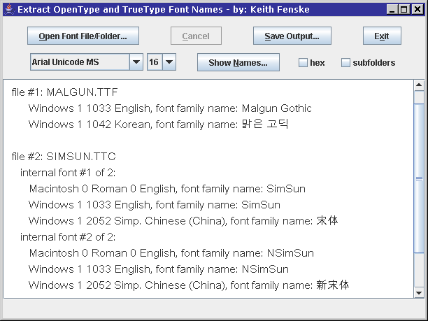

### Font Names (Java)

by: Keith Fenske, https://kwfenske.github.io/

FontNames is a Java 1.4 application to extract name fields or text strings from
OpenType (OTF) and TrueType (TTC, TTF) font files. There are over twenty
defined fields, including full name, family name, copyright, description,
designer, license, trademark, vendor, and version. These may appear in multiple
languages, and TrueType collections can contain more than one font.

Download the ZIP file here: https://kwfenske.github.io/font-names-java.zip

Released under the terms and conditions of the Apache License (version 2.0 or
later) and/or the GNU General Public License (GPL, version 2 or later).

